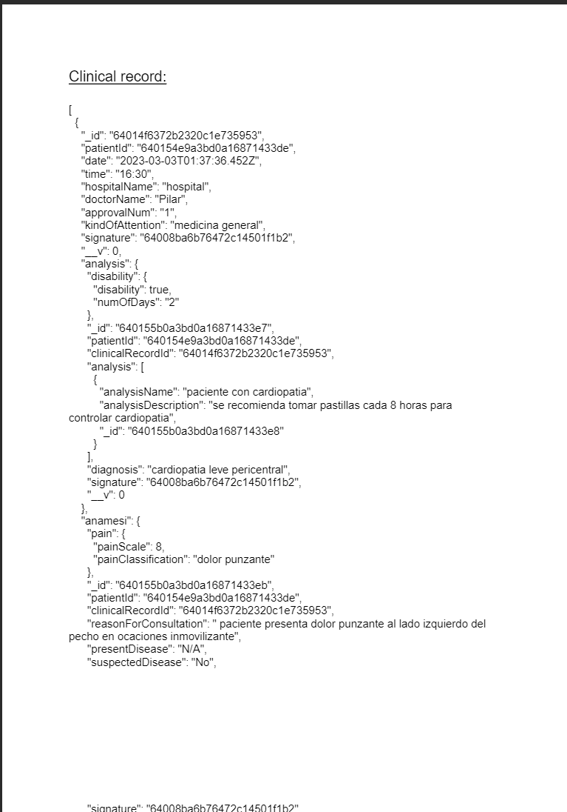

# clinicalRecords

usage:
GET:
/api/autentication 
example url : http:localhost:1234/api/autentication?id=640154e9a3bd0a16871433de&kindOfUser=patient
this url will be recibed like email
/api/patient/login
/api/hospital/login
/api/doctor/login
body:
```JSON
{
    "document":"159753456852",
    "pass": "pas123!123"
}
```
response:
```JSON
{
    "message": "access granted",
    "token": "85277dd57f3d7689317892da7ea20387abf9e9b915afc9f0ac5cd119", // TOKEN will be updated every day and have to be used like bearer token to auth user api request
    "id": "640154e9a3bd0a16871433de", // some request require the user id keep it 
    "name": "justina"
}
```

'/api/patient/changePassword'
'/api/hospital/changePassword'
'/api/doctor/changePassword'
example url: http:localhost:1234/api/doctor/changePassword?id=64008ba6b76472c14501f1b2
will open an web page with inputs to change the password and made the request to change the password

'/api/doctor/createRecord'
http://localhost:1234/api/doctor/createRecord?id=64008ba6b76472c14501f1b2&action=fillOutInformation
body:
```JSON
{
    "document":"159753456852"
}
```
'/api/patient/getClinicalRecords'
'/api/hospital/getClinicalRecords'
example url: http://localhost:1234/api/hospital/getClinicalRecords?id=63fffc6d9f5134d629413131
response: (array with all clinical records that containt the same hospital id)
```JSON
[
    {
        "_id": "64014f6372b2320c1e735953",
        "patientId": "640154e9a3bd0a16871433de",
        "date": "2023-03-03T01:37:36.452Z",
        "time": "16:30",
        "hospitalName": "hospital",
        "doctorName": "Pilar",
        "approvalNum": "1",
        "kindOfAttention": "medicina general",
        "signature": "64008ba6b76472c14501f1b2",
        "__v": 0,
        "analysis": {
            "disability": {
                "disability": true,
                "numOfDays": "2"
            },
            "_id": "640155b0a3bd0a16871433e7",
            "patientId": "640154e9a3bd0a16871433de",
            "clinicalRecordId": "64014f6372b2320c1e735953",
            "analysis": [
                {
                    "analysisName": "paciente con cardiopatia",
                    "analysisDescription": "se recomienda tomar pastillas cada 8 horas para controlar cardiopatia",
                    "_id": "640155b0a3bd0a16871433e8"
                }
            ],
            "diagnosis": "cardiopatia leve pericentral",
            "signature": "64008ba6b76472c14501f1b2",
            "__v": 0
        },
        "anamesi": {
            "pain": {
                "painScale": 8,
                "painClassification": "dolor punzante"
            },
            "_id": "640155b0a3bd0a16871433eb",
            "patientId": "640154e9a3bd0a16871433de",
            "clinicalRecordId": "64014f6372b2320c1e735953",
            "reasonForConsultation": " paciente presenta dolor punzante al lado izquierdo del pecho en ocaciones inmovilizante",
            "presentDisease": "N/A",
            "suspectedDisease": "No",
            "signature": "64008ba6b76472c14501f1b2",
            "otherDiagnoses": [],
            "__v": 0
        },
        "background": {
            "personalHistory": {
                "patology": "N/A",
                "toxic": "N/A",
                "hypersensitivity": "N/A",
                "pharmacological": "N/A",
                "occupational": "arquitecto",
                "surgical": "N/A",
                "transfusional": "N/A",
                "traumatic": "N/A",
                "allergies": "N/A",
                "allergiesCauses": "N/A",
                "gynecology": "N/A",
                "vaccination": [
                    "Covid-19 2 dosis moderna"
                ]
            },
            "_id": "640155b0a3bd0a16871433ee",
            "patientId": "640154e9a3bd0a16871433de",
            "clinicalRecordId": "64014f6372b2320c1e735953",
            "familyBackground": [
                {
                    "mother": "sin antecedentes"
                },
                {
                    "father": "sin antecedentes"
                }
            ],
            "signature": "64008ba6b76472c14501f1b2",
            "__v": 0
        },
        "medicine": {
            "_id": "640155b0a3bd0a16871433f1",
            "patientId": "640154e9a3bd0a16871433de",
            "clinicalRecordId": "64014f6372b2320c1e735953",
            "medicines": [
                {
                    "medicineName": "ibuprofeno- naproxeno",
                    "medicineDescription": "tomar cada 8 horas o en presencia del dolor",
                    "_id": "640155b0a3bd0a16871433f2"
                }
            ],
            "diagnosis": "cardiopatia leve pericentral",
            "signature": "64008ba6b76472c14501f1b2",
            "__v": 0
        },
        "referral": {
            "_id": "640155b0a3bd0a16871433f9",
            "patientId": "640154e9a3bd0a16871433de",
            "clinicalRecordId": "64014f6372b2320c1e735953",
            "specialist": [
                {
                    "specialistName": "Cardiologia primera vez",
                    "specialistDescription": "Se remite a cardiologia para evaluacion mas precisa",
                    "_id": "640155b0a3bd0a16871433fa"
                }
            ],
            "diagnosis": "cardiopatia leve pericentral",
            "signature": "64008ba6b76472c14501f1b2",
            "__v": 0
        },
        "surgery": null,
        "hospitalId": "63fffc6d9f5134d629413131"
    }
]
```
'/api/patient/downloadFile'
'/api/hospital/downloadFile'
example url: http://localhost:1234/api/hospital/downloadFile?id=63fffc6d9f5134d629413131
response with pdf with the JSON 
POST:
'/api/patient/register'
body:
```JSON
{
  "document": "159753456852",
  "name": "justina",
  "lastName": "del barrio",
  "email": "raufig@gmail.com", // can be tested with real gmail emails
  "phone": "35035035036",
  "pass": "pass123!"
}
```
'/api/hospital/register'
body:
```JSON
{

  "document": "159753456852-1",
  "name": "hospital",
  "address": "calle falsa 123",
  "email": "raufig@gmail.com",// can be tested with real gmail emails
  "phone": "35035035036",
  "pass": "pass123!",
  "medicalServicesProvided": [
    "pediatria",
    "gastroenterologia",
    "otros"
  ]
}
```
'/api/doctor/register' (required hospital be authenticated with bearer token)
body:
```JSON
{
  "document": "99999999",
  "name": "Pilar",
  "lastName": "Pilar",
  "email": "raufig@gmail.com", // can be tested with real gmail emails
  "phone": "35035035036",
  "pass": "pass123!",
  "profession": "Pediatra",
}
```
'/api/patient/changePassword'
'/api/hospital/changePassword'
'/api/doctor/changePassword'
example url: http://localhost:1234/api/hospital/changePassword?id=63fffc6d9f5134d629413131
body:
```JSON
{
    "newPassword":  "pass123!123"
}
```

'/api/doctor/createRecord'
http://localhost:1234/api/doctor/createRecord?id=64008ba6b76472c14501f1b2&action=fillOutInformation
body:
```JSON
{

    "Analysis":{
        "patientId":"640154e9a3bd0a16871433de",
        "signature": "64008ba6b76472c14501f1b2",
        "clinicalRecordId":"64014f6372b2320c1e735953",
        "analysis":[
            {
                "analysisName": "paciente con cardiopatia",
                "analysisDescription":"se recomienda tomar pastillas cada 8 horas para controlar cardiopatia"
            }
        ],
        "disability":{
            "disability":true,
            "numOfDays": 2
        },
        "diagnosis":"cardiopatia leve pericentral"
    },
    "Anamesi":{
        "patientId":"640154e9a3bd0a16871433de",
        "signature": "64008ba6b76472c14501f1b2",
        "clinicalRecordId":"64014f6372b2320c1e735953",
        "presentDisease":"N/A",
        "reasonForConsultation": " paciente presenta dolor punzante al lado izquierdo del pecho en ocaciones inmovilizante",
        "pain":{
            "painScale": 8,
            "painClassification": "dolor punzante"
        }
    },
    "Background":{
        "patientId":"640154e9a3bd0a16871433de",
        "signature": "64008ba6b76472c14501f1b2",
        "clinicalRecordId":"64014f6372b2320c1e735953",
        "personalHistory": {
            "patology":"N/A",
            "toxic":"N/A",
            "hypersensitivity":"N/A",
            "pharmacological":"N/A",
            "occupational":"arquitecto",
            "surgical":"N/A",
            "transfusional":"N/A",
            "traumatic":"N/A",
            "allergies":"N/A",
            "allergiesCauses":"N/A",
            "gynecology":"N/A",
            "vaccination":"Covid-19 2 dosis moderna"
        },
        "familyBackground": [
            {"mother":"sin antecedentes"},
            {"father":"sin antecedentes"}
        ]
    },
    "Medicine":{
        "patientId":"640154e9a3bd0a16871433de",
        "signature": "64008ba6b76472c14501f1b2",
        "clinicalRecordId":"64014f6372b2320c1e735953",
        "medicines":[
            {
                "medicineName":"ibuprofeno- naproxeno",
                "medicineDescription": "tomar cada 8 horas o en presencia del dolor"
            }
        ],
        "diagnosis":"cardiopatia leve pericentral"
    },
    "PhisicalExam":{
        "patientId":"640154e9a3bd0a16871433de",
        "signature": "64008ba6b76472c14501f1b2",
        "clinicalRecordId":"64014f6372b2320c1e735953",
        "vitalSigns":{
            "size":{
                "value":1.80,
                "UMT":"M"
            },
            "weight":{
                "value":90,
                "UMP":"Kg"
            },
            "IMC":0,
            "TAS":0,
            "TAD":0,
            "FC":0,
            "FR":0,
            "Temp":35
        },
        "physicalExam":[
            {
                "examName":"auscultación",
                "description": "paciente con corazon arritmico"
            }
        ]
    },
    "Referral":{
        "patientId":"640154e9a3bd0a16871433de",
        "signature": "64008ba6b76472c14501f1b2",
        "clinicalRecordId":"64014f6372b2320c1e735953",
        "specialist": [
            {
                "specialistName":"Cardiologia primera vez",
                "specialistDescription":"Se remite a cardiologia para evaluacion mas precisa"
            }
        ],
        "diagnosis":"cardiopatia leve pericentral"
    },
    "SurgeryOrder":{
        "patientId":"640154e9a3bd0a16871433de",
        "signature": "64008ba6b76472c14501f1b2",
        "clinicalRecordId":"64014f6372b2320c1e735953",
        "surgery":[
            {
                "surgeryName":"N/A",
                "surgeryDescription":"N/A"
            }
        ],
        "diagnosis":"cardiopatia leve pericentral"
    }
}
```
http://localhost:1234/api/doctor/createRecordid=64008ba6b76472c14501f1b2&action=createClinicalRecord
body:
```JSON
{
    "patientId":"63fff8811031696a3604c28d",
    "signature": "64008ba6b76472c14501f1b2",
    "time":"16:30",
    "hospitalName":"hospital",
    "doctorName": "Pilar",
    "approvalNum": 1,
    "kindOfAttention": "medicina general"
}
```
PUT:
'/api/patient/sendEmailChangePassword'
http://localhost:1234/api/patient/sendEmailChangePassword?email=raufig@gmail.com

'/api/hospital/sendEmailChangePassword'
http://localhost:1234/api/hospital/sendEmailChangePassword?email=raufig@gmail.com

'/api/doctor/sendEmailChangePassword'
http://localhost:1234/api/doctor/sendEmailChangePassword?email=raufig@gmail.com

update password function, check if the email is created in the database, and send an html to the email with instructions to change the password

@raufig